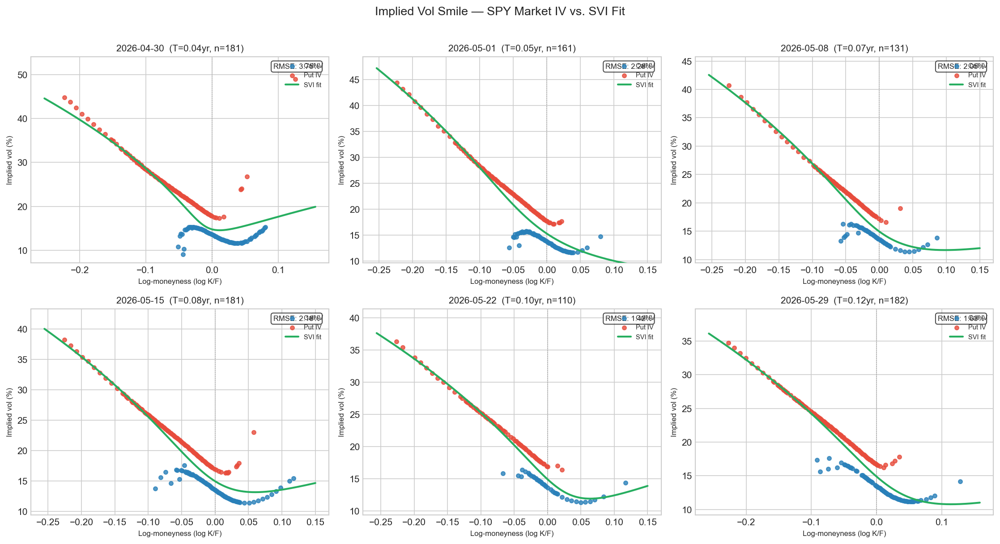
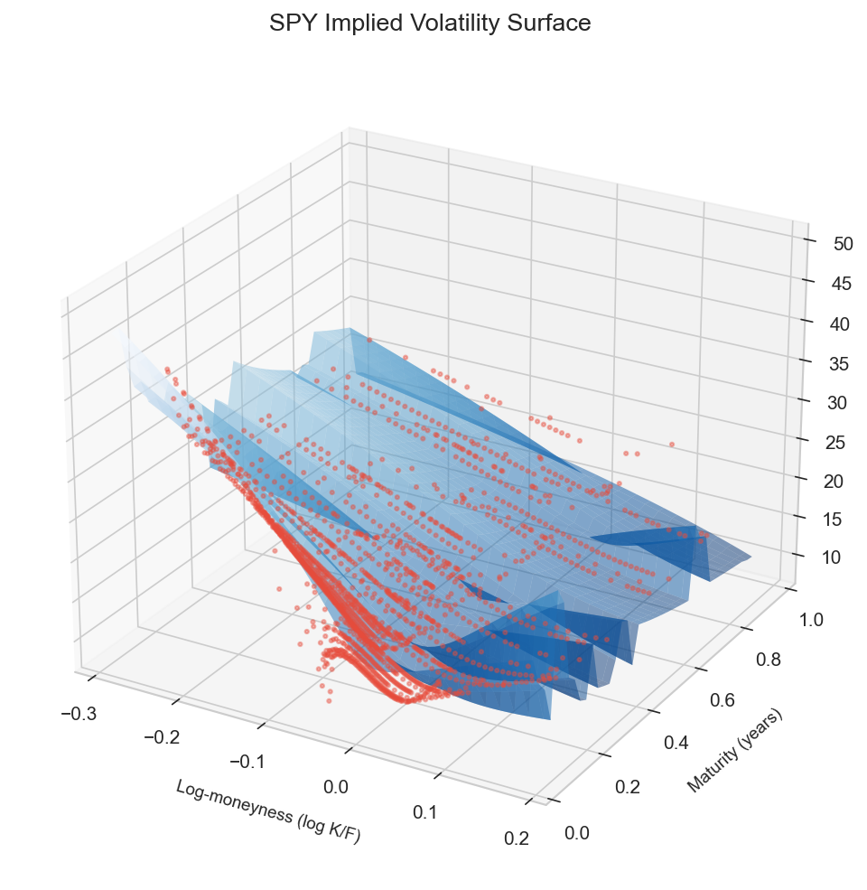
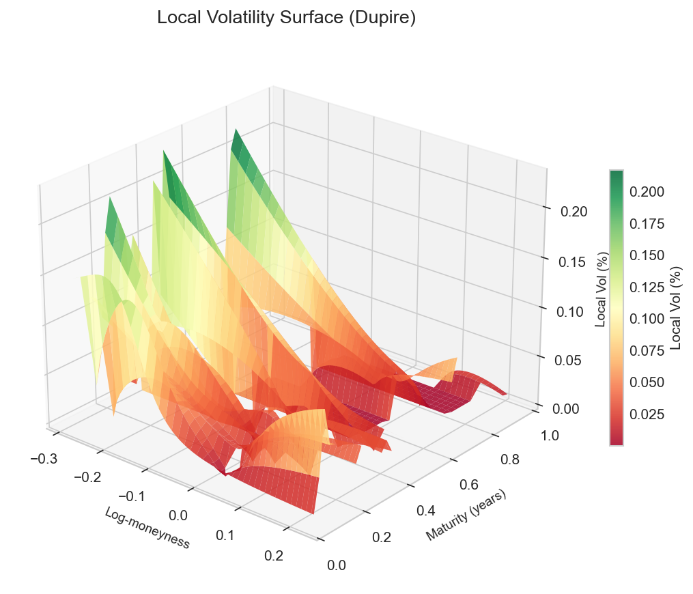

SPY Implied Volatility Surface
A from-scratch implementation of an equity options implied volatility surface: Black-Scholes pricing, IV inversion, SVI parameterisation and local volatility via Dupre's formula - built entirely on SPY options data

What this is and why it exits
Every options trader, structurer, and risk manager works with the
volatility surface daily. It's the map that tells you what the market
thinks volatility will be for any given strike and maturity — and it's
the input to pricing almost every exotic derivative that exists.
Black-Scholes assumes volatility is constant. The market knows this is
wrong. If you look at what implied volatility the market assigns to
different strikes and maturities, you get a surface that is anything but
flat. OTM puts trade at significantly higher implied vol than OTM calls.
Short-dated options have steeper skews than long-dated ones. These
patterns are not noise — they encode real information about how the
market prices tail risk, uncertainty, and the cost of hedging.
This project builds that surface from scratch: fetching live data,
computing IVs numerically, fitting a parametric model, and extracting
the local volatility function that makes the surface internally
consistent

Each panel is one expiry date. The x-axis is log-moneyness — zero is
exactly at-the-money (ATM), negative numbers are OTM puts (downside
protection), positive numbers are OTM calls (upside exposure). The
y-axis is implied volatility in percent.

What the shape is telling you:
Every panel shows the same fundamental pattern: implied vol is high on
the left (OTM puts) and low on the right (OTM calls). For SPY in April
2026, OTM puts at log-moneyness -0.20 are pricing at roughly 35-42%
implied vol, while OTM calls at +0.10 are around 10-13%. That is a
difference of 25-30 percentage points across the same underlying.
This is the equity volatility skew, and it exists for a structural
reason: institutional investors constantly buy OTM puts to hedge their
equity exposure. That persistent demand bids up put prices, which bids
up their implied vol. Calls do not have the same structural buyer, so
they are cheaper relative to the model. The market is not being
irrational — it is correctly pricing the asymmetry of equity risk.

The green SVI curve:
The SVI (Stochastic Volatility Inspired) model fits a smooth parametric
curve through the data points. RMSEs of 2-3% across all panels mean the
fitted curve is within 2-3 percentage points of implied vol at every
strike — good fit quality for real market data where bid-ask spreads
on individual contracts can themselves be 1-2% wide.
The small kink where the red and blue dots meet (around k=0) is where
put contracts hand off to call contracts. Puts and calls on the same
strike should have the same IV by put-call parity, but in practice
they are quoted by different market makers with slightly different
liquidity, so they do not join perfectly. This is a real market
microstructure effect, not a fitting failure.

Why no cubic spline:
An earlier version of this project used cubic splines for interpolation.
On these panels, cubic splines oscillated to hundreds or thousands of
percent implied vol between data points — a well-known numerical
pathology called Runge's phenomenon that makes them unusable on sparse,
irregularly spaced options data. SVI was invented specifically to
avoid this.

The three axes are: log-moneyness (x), maturity in years (y), and
implied vol in percent (z). The red dots are raw market IV quotes. The
blue slices are the SVI-fitted surface at each expiry.

What to look for:
The surface slopes sharply downward from left (OTM puts, high IV) to
right (OTM calls, low IV) — this is the skew in three dimensions. It
also flattens as maturity increases (moving toward the back of the
chart): the term structure of volatility. Short-dated options have
a steep skew because near-term uncertainty is elevated; longer-dated
options have a shallower skew because the market expects mean-reversion
over time.
The blue slices are flat planes rather than smoothly curved sheets
because each expiry is fitted independently. A joint surface
parameterisation (SSVI) would produce smoother cross-sections, but
requires solving a harder optimisation problem across all maturities
simultaneously.

Interactive 3D surface (plotly)
Open vol_surface_interactive.html in any browser to rotate, zoom, and
hover over individual points. The tooltip shows exact log-moneyness,
maturity, and implied vol at any location.
At k=-0.049, T=0.27yr, the surface reads 19.9% implied vol — roughly
5% OTM put at a three-month horizon. ATM SPY vol in this period is
around 15-16%, so this represents a roughly 4% skew premium for being
slightly OTM. That is consistent with a moderately elevated volatility
environment.

This surface is fundamentally different from the implied vol surface.
Implied vol is an average — the single constant volatility that would
make Black-Scholes reproduce an option's price. Local vol is
instantaneous — the volatility the model assigns to each specific
point in (price, time) space.
Dupire (1994) showed these two representations are mathematically
equivalent given a complete surface. You can always extract local vol
from implied vol via a formula involving partial derivatives of the
surface.

What this surface shows:
Local vol ranges from roughly 2% (dark red, OTM calls at long
maturities — low instantaneous vol expected there) to 20% (green
peaks, OTM put region at short maturities — high instantaneous vol
where the market expects the most stress). The surface is positive
almost everywhere, which means the fitted implied vol surface is
largely free of butterfly arbitrage. A negative local vol anywhere
would indicate an arbitrage opportunity embedded in the surface.
The jagged ridges between expiry slices are where the piecewise SVI
fits do not connect smoothly — a known limitation of fitting each
expiry independently, and a diagnostically useful artefact showing
exactly where a joint fit would be needed. The spikes at the far
left (deep OTM put region) are expected: Dupire amplifies the steepest
gradient of the surface through finite differencing, and the steep
put wing naturally produces higher local vol there.

What the SVI parameters mean
The SVI model at each expiry fits five numbers:
w(k) = a + b * [ rho*(k - m) + sqrt((k - m)^2 + sigma^2) ]
where k is log-moneyness and w = IV^2 * T is total implied variance.

a - Overall variance level - 0.001 to 0.010
b - Wing steepness (scaled to T) - b_scale * 1-5
rho - Skew direction — negative = puts more expensive - -0.85 to -0.99
m - Location of variance minimum - -0.02 to +0.05
sigma - Curvature — higher = more pronounced smile - 0.05 to 0.15

For SPY, rho consistently fits around -0.85 to -0.99, confirming the
strong negative skew. The variance minimum m is slightly positive on
most expiries, meaning the true variance low point is slightly OTM call
— consistent with the idea that the market is most comfortable pricing
options just above ATM.

Tech stack

Python 3.11
yfinance   — live SPY options chain
scipy      — Brent's method for IV inversion, L-BFGS-B for SVI fitting
numpy      — numerical grids and finite differences for Dupire
pandas     — liquidity filtering pipeline
matplotlib — static 3D surface and per-expiry smile charts
plotly     — interactive 3D surface exported as standalone HTML